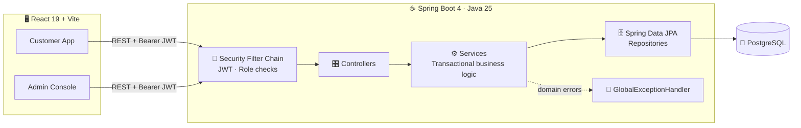
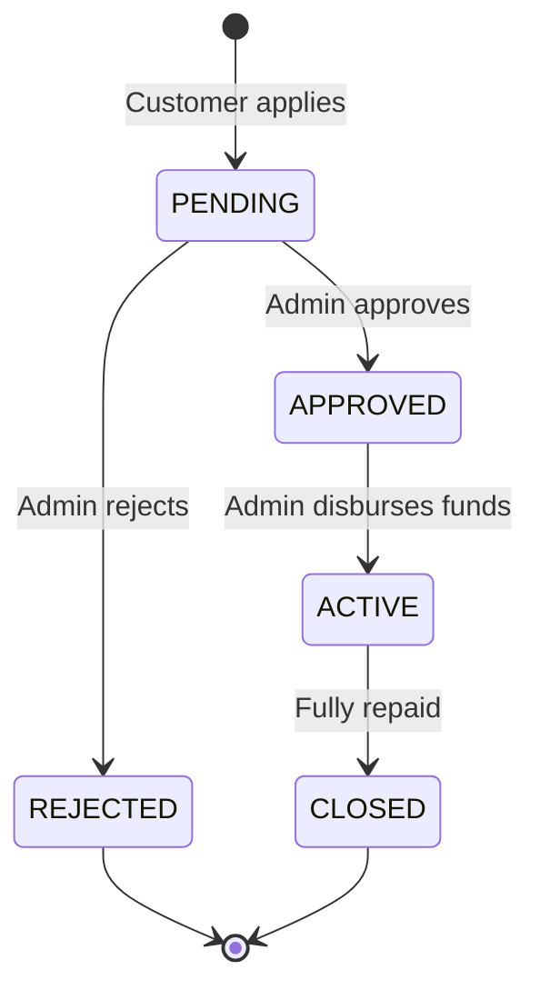
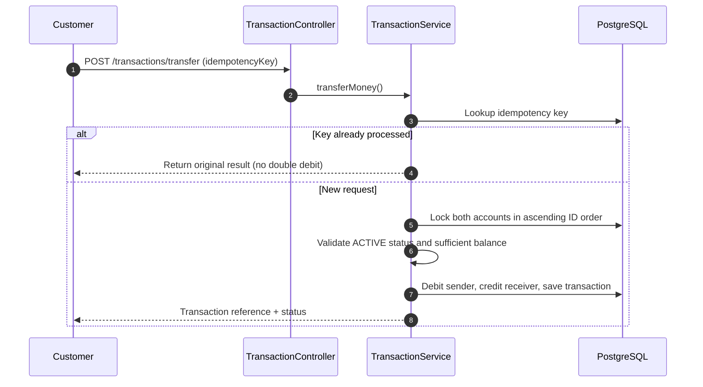

<!-- ============================== HEADER ============================== -->
<div align="center">


<a href="https://github.com/YOUR_USERNAME/BankEase">
  
</a>

<br/>


**[Features](#-features) · [Architecture](#-architecture) · [Quick Start](#-quick-start) · [API](#-api-reference) · [Security](#-security-design) · [Roadmap](#-roadmap)**

</div>

---

## 🏦 What is BankEase?

**BankEase** is a full-stack net-banking application that models how a real bank behaves behind the screen: **customers** open accounts, move money, pay bills and apply for loans, while **admins** govern users, accounts, billers and the entire loan lifecycle, with every sensitive action written to an **audit log**.

It is built to show backend engineering that holds up under pressure:

> 💡 Two people hitting *Transfer* at the same time, a double-clicked *Pay* button, a retried network request. BankEase is designed so that **money is never lost, duplicated or double-spent.**

<table>
<tr>
<td width="33%" align="center">🔐<br/><b>Secure by default</b><br/><sub>BCrypt hashing, stateless JWT, deny-by-default routing</sub></td>
<td width="33%" align="center">⚖️<br/><b>Financially safe</b><br/><sub>Idempotency keys, pessimistic locks, deadlock-free ordering</sub></td>
<td width="33%" align="center">🧾<br/><b>Fully accountable</b><br/><sub>Admin actions captured in a queryable audit trail</sub></td>
</tr>
</table>

---

## ✨ Features

<table>
<tr>
<td valign="top" width="50%">

### 👤 Customer Experience
- 🆕 Self-service registration and login
- 💳 Open **Savings** or **Current** accounts
- 💸 Transfer money between accounts with a guided flow
- 🧾 Pay bills to admin-managed billers, with receipts
- 🏠 Apply for **Personal, Home, Education or Vehicle** loans
- 📈 Track loan progress on a visual timeline
- 💰 Repay loans and view repayment history
- 📄 **Printable statement** and one-click **CSV export**
- 🙈 **Hide balances** toggle for privacy
- ⌨️ **`Ctrl / ⌘ + K`** command palette for instant navigation

</td>
<td valign="top" width="50%">

### 🛡️ Admin Console
- 👥 View, search and **activate / deactivate users**
- 🏧 **Block / activate accounts**, with dev-mode account funding
- 🏢 Create billers and toggle their availability
- 📝 Review loan applications: **approve or reject**
- 💵 **Disburse** approved loans to the customer's account
- 🕵️ Browse the **audit log**, filterable by action
- 📊 Overview dashboard with platform health at a glance

</td>
</tr>
</table>

---

## 🧱 Architecture



### 🔄 Loan Lifecycle



### 💸 What happens inside a transfer



### 🗂️ Project Structure

```text
BankEase/
├── 📁 src/main/java/com/bankease/
│   ├── 📁 config/        # SecurityConfig (JWT + RBAC), AdminDataInitializer
│   ├── 📁 controller/    # REST endpoints (customer + admin)
│   ├── 📁 service/       # Transactional business logic, JwtService, audit
│   ├── 📁 repository/    # Spring Data JPA (with pessimistic-lock queries)
│   ├── 📁 entity/        # Users, Account, Transaction, Loan, Biller, AuditLog ...
│   ├── 📁 dto/           # Validated request / response contracts
│   └── 📁 exception/     # Typed domain exceptions + global handler
├── 📁 src/main/resources/application.properties
├── 📁 bankease_frontend/ # React 19 + Vite single-page app
│   └── src/ (main.jsx, api.js, styles.css)
└── 📄 pom.xml
```

---

## 🛠️ Tech Stack

| Layer | Technology |
|:--|:--|
| **Language** | Java 25 |
| **Backend** | Spring Boot 4.1 · Spring Web MVC · Spring Data JPA (Hibernate) · Bean Validation |
| **Security** | Spring Security OAuth2 Resource Server (HS256 JWT) · BCrypt password hashing |
| **Database** | PostgreSQL |
| **Frontend** | React 19 · React Router 6 · Vite 7 · Lucide Icons |
| **Build / Tooling** | Maven Wrapper · npm · Lombok |

---

## 🚀 Quick Start

### Prerequisites

- ☕ **JDK 25**
- 🐘 **PostgreSQL** running locally
- 🟢 **Node.js 18+** and npm

### 1️⃣ Clone

```bash
git clone https://github.com/YOUR_USERNAME/BankEase.git
cd BankEase
```

### 2️⃣ Create the database

```sql
CREATE DATABASE bankease;
```

### 3️⃣ Set environment variables

BankEase never stores secrets in source. Provide them at runtime:

| Variable | Required | Description |
|:--|:--:|:--|
| `DB_PASSWORD` | ✅ | PostgreSQL password for user `postgres` |
| `JWT_SECRET` | ✅ | Signing key for HS256, **at least 32 characters** |
| `ADMIN_PASSWORD` | ✅ | Password for the auto-created admin account |
| `ADMIN_EMAIL` | ➖ | Admin login email (default: `admin@bankease.com`) |

<details>
<summary><b>🐧 macOS / Linux</b></summary>

```bash
export DB_PASSWORD='your_db_password'
export JWT_SECRET='replace-with-a-long-random-string-of-32+chars'
export ADMIN_PASSWORD='choose-a-strong-admin-password'
```
</details>

<details>
<summary><b>🪟 Windows (PowerShell)</b></summary>

```powershell
$env:DB_PASSWORD   = "your_db_password"
$env:JWT_SECRET    = "replace-with-a-long-random-string-of-32+chars"
$env:ADMIN_PASSWORD = "choose-a-strong-admin-password"
```
</details>

### 4️⃣ Run the backend

```bash
./mvnw spring-boot:run        # Windows: mvnw.cmd spring-boot:run
```

The API starts on **http://localhost:8080**. Tables are created automatically and the admin account is seeded on first launch.

### 5️⃣ Run the frontend

```bash
cd bankease_frontend
npm install
npm run dev
```

Open **http://localhost:5173** 🎉. The Vite dev server proxies API calls to the backend, so no CORS setup is needed locally.

> 🪟 On Windows you can also run `start-frontend.ps1` inside `bankease_frontend`.

### 🔑 First login

| Role | How |
|:--|:--|
| 🛡️ **Admin** | Log in with `ADMIN_EMAIL` (default `admin@bankease.com`) and your `ADMIN_PASSWORD` |
| 👤 **Customer** | Register from the sign-up screen, then open an account |

---

## 📡 API Reference

All routes except `/users` and `/login` require `Authorization: Bearer <token>`.

<details open>
<summary><b>🔓 Public</b></summary>

| Method | Endpoint | Purpose |
|:--:|:--|:--|
| `POST` | `/users` | Register a customer |
| `POST` | `/login` | Authenticate and receive a JWT (valid for 1 hour) |

</details>

<details>
<summary><b>👤 Customer</b> · requires <code>ROLE_CUSTOMER</code></summary>

| Method | Endpoint | Purpose |
|:--:|:--|:--|
| `POST` | `/accounts` | Open a Savings or Current account |
| `GET` | `/accounts` · `/accounts/{accountNumber}` | List accounts / fetch one |
| `POST` | `/transactions/transfer` | Transfer funds (idempotent) |
| `GET` | `/transactions` · `/transactions/{reference}` | Transaction history / lookup |
| `GET` | `/billers` · `/billers/{id}` | Browse billers *(any authenticated user)* |
| `POST` | `/bills/payments` | Pay a bill (idempotent) |
| `GET` | `/bills/payments` · `/bills/payments/{paymentReference}` | Bill payment history / receipt |
| `POST` | `/loans/applications` | Apply for a loan |
| `GET` | `/loans/applications` · `/loans/applications/{applicationReference}` | Track applications |
| `GET` | `/loans` · `/loans/{loanReference}` | Active and closed loans |
| `POST` | `/loans/{loanReference}/repay` | Repay a loan (idempotent) |
| `GET` | `/loans/{loanReference}/repayments` | Repayment history |

</details>

<details>
<summary><b>🛡️ Admin</b> · requires <code>ROLE_ADMIN</code></summary>

| Method | Endpoint | Purpose |
|:--:|:--|:--|
| `GET` | `/admin/users` · `/admin/users/{id}` | Browse users |
| `PATCH` | `/admin/users/{id}/status` | Activate / deactivate a user |
| `PATCH` | `/admin/accounts/{accountNumber}/status` | Block / activate an account |
| `POST` | `/admin/accounts/{accountNumber}/deposit` | Fund an account (development use) |
| `POST` | `/admin/billers` | Create a biller |
| `GET` | `/admin/billers/{id}` | View a biller |
| `PATCH` | `/admin/billers/{id}/status` | Activate / deactivate a biller |
| `GET` | `/admin/loans/applications` | List loan applications |
| `PATCH` | `/admin/loans/applications/{applicationReference}/status` | Approve / reject an application |
| `POST` | `/admin/loans/applications/{applicationReference}/disburse` | Disburse an approved loan |
| `GET` | `/admin/audit-logs` · `/admin/audit-logs/my` · `/admin/audit-logs/action/{action}` | Audit trail |

</details>

### 🧪 Try it with cURL

```bash
# 1. Register
curl -X POST http://localhost:8080/users \
  -H "Content-Type: application/json" \
  -d '{"fullname":"Test User","email":"test@example.com","phone":"9876543210","password":"strongPass123"}'

# 2. Login (copy the "token" from the response)
curl -X POST http://localhost:8080/login \
  -H "Content-Type: application/json" \
  -d '{"email":"test@example.com","password":"strongPass123"}'

# 3. Open a savings account
curl -X POST http://localhost:8080/accounts \
  -H "Authorization: Bearer <TOKEN>" -H "Content-Type: application/json" \
  -d '{"accountType":"SAVINGS"}'

# 4. Transfer money (reusing the same idempotencyKey never double-debits)
curl -X POST http://localhost:8080/transactions/transfer \
  -H "Authorization: Bearer <TOKEN>" -H "Content-Type: application/json" \
  -d '{"idempotencyKey":"txn-001","senderAccountNumber":"<FROM>","receiverAccountNumber":"<TO>","amount":500.00,"remarks":"Rent"}'
```

---

## 🔐 Security Design

| Concern | How BankEase handles it |
|:--|:--|
| 🔑 **Passwords** | Hashed with **BCrypt**; never stored in plain text |
| 🎟️ **Authentication** | Stateless **JWT (HS256)** issued at login, 1-hour expiry |
| 🚦 **Authorization** | Role-based rules: `/admin/**` → ADMIN, banking routes → CUSTOMER |
| 🚫 **Unknown routes** | **Deny-by-default**: anything not explicitly allowed returns an error |
| 🔁 **Duplicate requests** | **Idempotency keys** on transfers, bill payments and loan repayments |
| 🧵 **Concurrency** | **Pessimistic write locks** on accounts and loans during money movement |
| ☠️ **Deadlocks** | Accounts are always locked in **ascending ID order**, so A→B and B→A cannot deadlock |
| 🧯 **Account safety** | Blocked accounts cannot send or receive; insufficient-balance checks run inside the transaction |
| 🧾 **Accountability** | Admin actions (blocks, deposits, loan decisions, biller changes) recorded in the audit log |
| 🤫 **Secrets** | DB password, JWT secret and admin credentials are injected via environment variables |
| ✅ **Input validation** | Bean Validation on DTOs (e.g. 10-digit phone, minimum 8-character password) |
| 🚨 **Errors** | Typed domain exceptions mapped to clean responses by a global handler |

---

## 🧭 Roadmap

- [ ] 🧮 EMI / amortization schedule for loans
- [ ] 📚 Unified financial ledger (transfers, bills, repayments, deposits in one timeline)
- [ ] 🔒 Immediate JWT invalidation when a user is deactivated
- [ ] 🐳 Docker Compose for one-command setup
- [ ] 🧪 Expanded unit and integration test coverage
- [ ] 📖 OpenAPI / Swagger documentation
- [ ] 🔔 Email / SMS notifications for transactions and loan decisions

---

## 📸 Screenshots

> Add your own screenshots here. Drop images into a `docs/screenshots/` folder and reference them below.

| Customer Dashboard | Transfer Flow | Admin Console |
|:--:|:--:|:--:|
|  |  |  |

---

## 🤝 Contributing

Contributions, issues and feature ideas are welcome.

1. 🍴 Fork the repository
2. 🌿 Create a branch: `git checkout -b feature/amazing-feature`
3. 💾 Commit your changes: `git commit -m "Add amazing feature"`
4. 🚀 Push the branch: `git push origin feature/amazing-feature`
5. 🔃 Open a Pull Request

---

## 👨‍💻 Author

<div align="center">

**Aryan Mishra**
B.Tech CSE (Data Science) · ABES Engineering College, Ghaziabad

[](https://github.com/YOUR_USERNAME)
[](https://www.linkedin.com/in/YOUR_LINKEDIN)

</div>

---

<div align="center">

⭐ **If BankEase helped or inspired you, please give it a star!** ⭐


</div>
